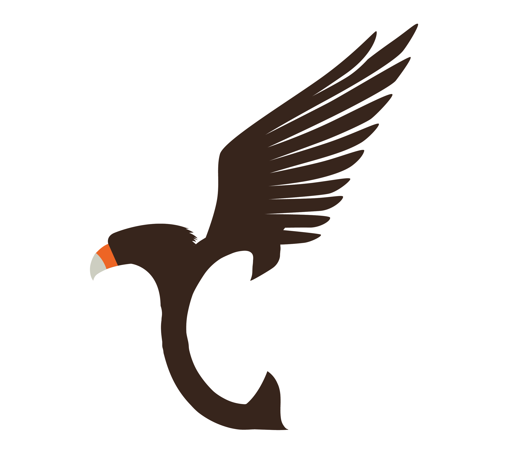

<div align="center">
    
    <h1>Project Carcará</h1>
</div>

---

## :information_source: What is the project ?

This project as a installation script for some development applications and settings for my 🐧 Linux environment.

## :coffee: Who to use

Only perform the following steps:

<h4><strong>Clone this repository</strong></h4>

```
$ git clone https://github.com/cogumm/myLinux.git

# Accessing the directory.
$ cd 'myLinux/carcara/'

# Running the program.
$ sudo bash startApp.sh
```

## Project structure

This project has the following structure:

```
.
├── app
│   ├── assets
│   │   └── img
│   │       ├── logo.png
│   │       └── wat-dog.jpg
│   ├── config
│   │   ├── config.sh
│   │   ├── dependences.sh
│   │   ├── license
│   │   ├── menuGeral.sh
│   │   └── testConnection.sh
│   └── scripts
│       ├── software
│       │   ├── development
│       │   │   ├── firacode.sh
│       │   │   ├── git.sh
│       │   │   ├── insomnia.sh
│       │   │   └── vscode.sh
│       │   ├── menuSof.sh
│       │   ├── productivity
│       │   │   └── dropbox.sh
│       │   ├── social
│       │   │   ├── discord.sh
│       │   │   ├── _menu.sh
│       │   │   ├── spotify.sh
│       │   │   └── telegram.sh
│       │   └── utilities
│       │       ├── _menu.sh
│       │       └── vlc.sh
│       └── system
│           ├── cleanDistro.sh
│           ├── fixSystem.sh
│           └── updateDistro.sh
├── README.md
└── startApp.sh
```
